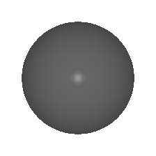
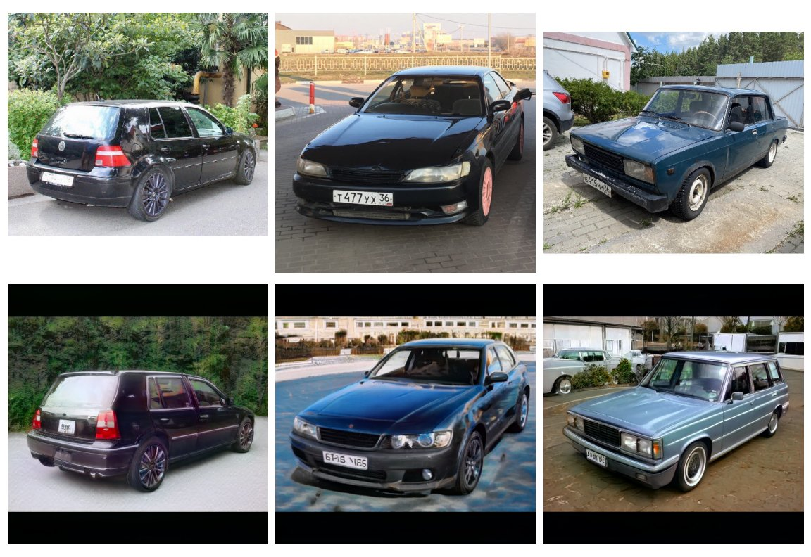

## Collection of random experiments

### CLIP score optimization through differentiable render

An attempt to optimize a 3d mesh to a specific text query.
Maximization of cosine similarity of CLIP's text embedding and rendered mesh through differentiable rendering.

References:
- [pytorch3d](https://github.com/facebookresearch/pytorch3d)
- [CLIP](https://github.com/openai/CLIP)

### CLIP score optimization through StyleGAN2

Latent vector optimization of StyleGAN2 for a specific text query(CLIP embedding).
Attempt to use it in image2image scenario to make different text-conditioned transformations, rather than just random sampling by text.

References:
- [StyleGAN2](https://github.com/rosinality/stylegan2-pytorch)
- [CLIP](https://github.com/openai/CLIP)

